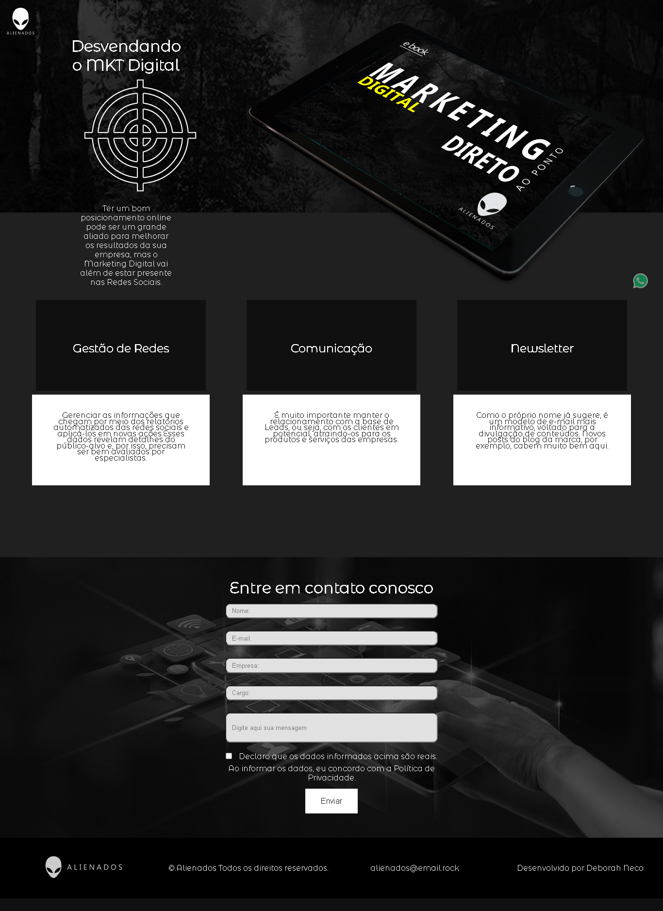

#Web Designer - Senac SP

Projeto 1 construído durante o curso de Web Designer no Senac SP São Miguel Paulista.

[Clique aqui para acessar](https://deb-neco.github.io/projeto_senac_alienados)

## Tecnologias

- Html
- Css

Contato
deborahneco@outlook.com